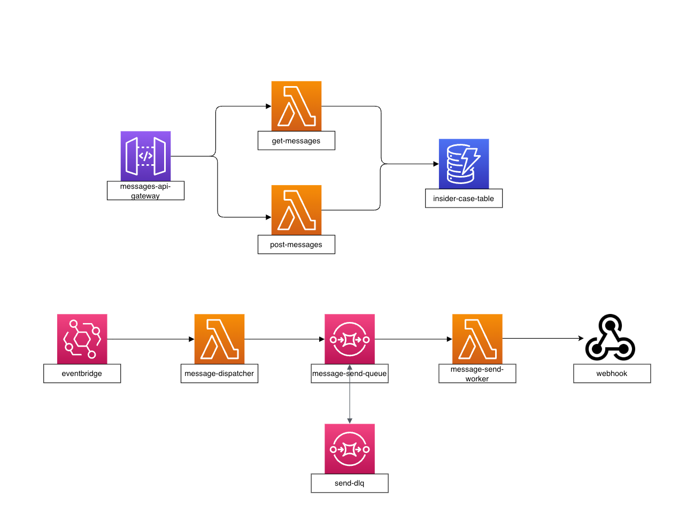

# Insider Case – Messaging Service

This document covers setup, env vars, flow, and where to find the API spec. A live base URL and credentials placeholder are included; update them as needed.

- **Live Base URL:** `https://<your-api>.execute-api.<region>.amazonaws.com/<stage>`
- **Basic Auth:** `AUTH_USER: <set>` / `AUTH_PASS: <set>`

## Setup
- Requirements: Node.js 18+/npm, AWS SAM CLI (for deploy), AWS account with Lambda/SQS/DynamoDB permissions.
- Install deps:
  ```sh
  npm install          # root
  cd src/layers/nodejs/src && npm install && npm run build
  ```
- Build: `npm run build` (root) builds functions and the shared layer.

## Environment Variables (used in stacks)
- Global: `AppName`, `EnvName`, `Suffix`, `ReleaseVersion`, `EnvTag`, `ServiceTag`
- API auth: `AUTH_USER`, `AUTH_PASS` (leave empty to disable basic auth)
- Dispatcher:
  - `MESSAGES_TABLE` (DynamoDB table name)
  - `PENDING_LIMIT` (max items enqueued per run; currently 24)
  - `MESSAGE_SEND_QUEUE_URL` (SQS URL)
- Worker:
  - `MESSAGES_TABLE`
  - `WEBHOOK_URL` (target webhook)
  - `MAX_MESSAGE_LENGTH` (content length limit; enforced on create and send)
- Layer/services also accept `WEBHOOK_AUTH_KEY`, but it is not used currently.

## Flow



- POST `/messages`: validate body `{"messages":[{to, content}]}`; write each item to DynamoDB as `PENDING` (length checked).
- EventBridge → `message-dispatcher` (every minute): picks up to `PENDING_LIMIT`, marks `IN_PROGRESS`, pushes to SQS `message-send-queue`.
- SQS → `message-send-worker` (batch 2): sends to external `WEBHOOK_URL` with small delay for rate‑limit; on success updates record to `SENT` with `messageId/sentAt`; failures retry via SQS and go to DLQ.
- GET `/messages`: returns `SENT` messages.

## Swagger/OpenAPI
- `docs/openapi.yaml` contains the API schema. You can view locally with e.g. `npx swagger-ui-watcher docs/openapi.yaml`.

## Notes
- If webhook response lacks `messageId`, the send is treated as failure and retried.
- Exceeding `MAX_MESSAGE_LENGTH` is rejected at POST validation and marked FAILED at send stage.
- Production endpoints (current):
  - Health: `https://mg3gv5c2rb.execute-api.us-west-2.amazonaws.com/dev/health`
  - Messages: `https://82jfwu9id7.execute-api.us-west-2.amazonaws.com/dev/messages`
  - Basic Auth: `testuser` / `testpass`
